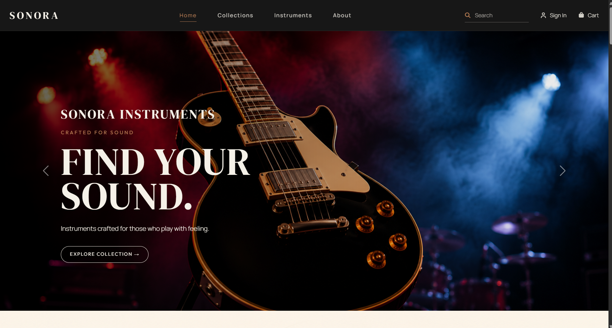

SONORA 🎸

A modern, responsive musical instruments website built with HTML, CSS, and Bootstrap 5, combining responsive layouts with custom styling to create a premium visual experience.

✨ Features

* Responsive navigation with search and account actions
* Auto-playing hero carousel with promotional slides
* Featured instrument showcase with product specifications
* Instrument collections
* Best-selling products with ratings, pricing, and actions
* Brand highlights and craftsmanship showcase
* Promotional call-to-action banner
* Newsletter subscription section
* Responsive layout across desktop, tablet, and mobile

🛠️ Technologies Used

* HTML5
* CSS3
* Bootstrap 5

📱 Responsive Design

Built with Bootstrap's responsive grid and utility classes, complemented by custom CSS for SONORA's visual design and animations.

🌐 Live Demo

[View SONORA Live](YOUR-LIVE-WEBSITE-LINK)

